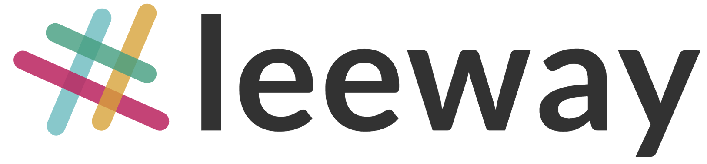
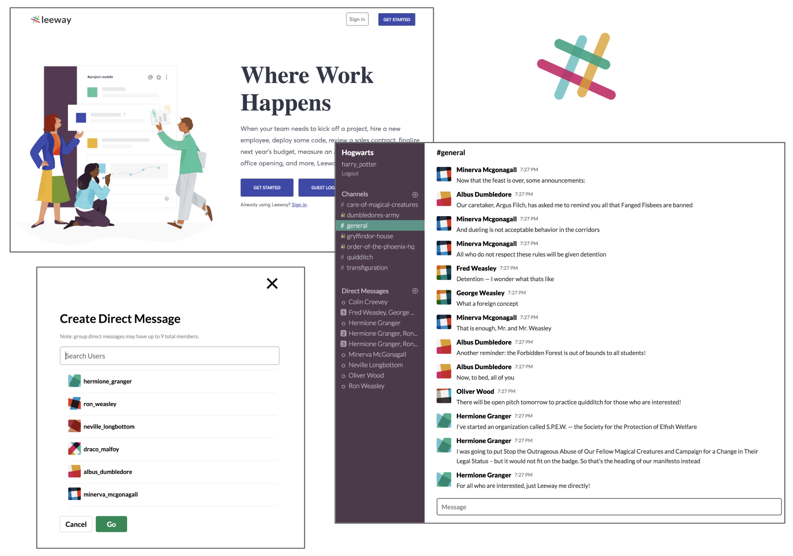

<p align="center"></p>

<h1 align="center">Leeway</h1>

<p align="center">
  <a href="https://leewayapp.herokuapp.com/">Live Demo!</a>
</p>

<p align="center">
  <a href="#technologies">Technologies</a> •
  <a href="#key-features">Key Features</a> •
  <a href="#project-design">Project Design</a> •
  <a href="#additional-resources">Additional Resources</a> •
  <a href="#pending-features">Pending Features</a>
</p>

<p align="center">A Slack clone implemented using a Rails backend and React/Redux frontend framework. Users can create channels or direct messages to converse with a single person or multiple people.</p>

<p align="center"></p>
Note: this project was designed and built within a two-week time frame, though I intent to add enhancements over time.

## Technologies
- Websockets: ActionCable
- Ruby on Rails
- React
- Redux
- Postgresql Database
- Amazon Web Services for profile pictures

## Key Features
- Secure frontend to backend user authentication using BCrypt
- Users can create channels or direct messages, and read those they have permission to
- Users can create, read, update, and delete messages in those chats
- Message feed dynamically updates to display all messages within that chat

### Live Chat


Leeway utilizes ActionCable, a WebSocket framework for Rails, allowing open connections for real-time server communication.

```js
// frontend/components/message/message_feed.jsx
createSocket(channelId) {
  const cable = Cable.createConsumer('wss://leewayapp.herokuapp.com/cable');
  this.chats = cable.subscriptions.create(
    { channel: "MessagesChannel", messageable_id: channelId },
    {
      received: (data) => {
        data.messageable_id = channelId;
        this.props.receiveMessage(data);
      }
    });
}
```

On the backend, streams are dynamically created using params sent from the frontend MessageFeed:
```rb
# app/channels/messages_channel.rb
def subscribed
  stream_from "chat-#{params['messageable_id']}:messages"
end
```

Messages are also broadcasted to all users who are subscribed to the specified channel:
```rb
# app/models/message.rb
after_create_commit do
  ActionCable.server.broadcast "chat-#{messageable_id}:messages",
    id: id,
    body: body,
    author_id: author_id,
    author: author.format_username,
    messageable_type: messageable_type,
    timestamp: created_at.strftime("%-I:%M %p")
end
```

### Channel and Direct Message Creation


The direct message create form is more complex than that for channel, because it involves a user search.

After rendering only the users that match the search query, clicking a username adds it to the list of members for that dm. Clicking it again will remove it from that list:

```js
clickUsername(userId) {
  return e => {
    e.preventDefault();

    const user = this.props.allUsers[userId];
    let oldUsers = this.state.selectedUsers;

    //if username is not selected yet
    if( this.state.selectedUsers[userId] === undefined ) {
      oldUsers[userId] = {user};
      this.setState( {selectedUsers: oldUsers} );
    } else {
      delete oldUsers[userId];
      this.setState( {selectedUsers: oldUsers} );
    }
  };
}
```
After clicking the create button for either form, permissions to access that chat are created for the current user and all selected users, in the case of dm's.

### Message Editing and Deletion


The edit and delete buttons for a message to be conditionally visible when the user hovers over the message. A check for if the current user is the author of the message is conducted:
```js
showEditDelete() {
  if( this.props.currentUserId === this.props.message.author_id && !this.state.editing ) {
    this.setState( {visible: true} );
  }
}
```
The edit button (the delete button is very similar):
```js
<button
  className={ `edit-message-button-${this.state.visible}` }
  onClick={ this.handleEditClick() }>
  &#x270E;
</button>
```
Upon click of the edit button, an edit form is rendered where the message was.

## Project Design
Considering the two-week time period, the aim was for Leeway to mirror was a core set of Slack's features.

Regarding the schema, messages were initially going to polymorphically belong to both channels and direct messages. However, because of the considerable overlap in functionality of channels and direct messages, channels have a boolean ```is_dm``` column to designate some as direct messages.

## Additional Resources
- [Database Schema](https://github.com/aguamenti/Leeway/wiki/Database-Schema)
- [API Endpoints](https://github.com/aguamenti/Leeway/wiki/Backend-Routes)

## Pending Features
- Channel/direct message edit and delete
- Message search
- User profiles show and edit
